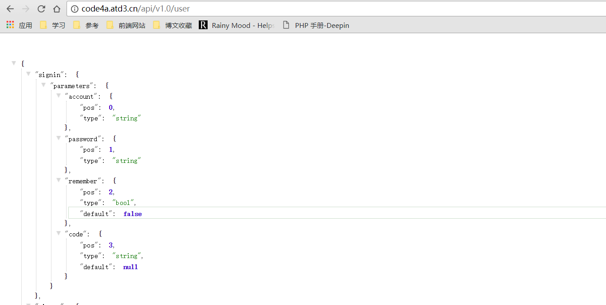
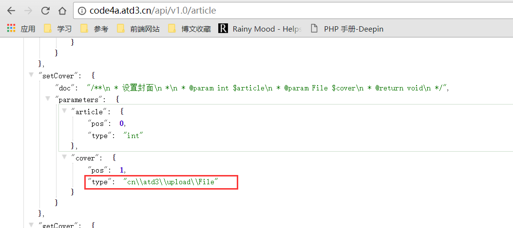

# 程序API接口

程序与远程服务器进行交互，使用JSON或者FROM，已经封装在交互包 `atd-proxy.jar` 中，运行结果类似RPC，遵循不完整的RPC2.0
对RPC2.0进行了扩展和修改，已经封装，项目地址：https://github.com/DXkite/APIProxyCall-JavaClient

## 使用说明

一个远程调用只包括链接，通过一个链接调用链接所支持的各种方法。链接所支持的方法由链接描述给出。
接口直接访问后会获取到JSON的接口信息描述。大致的接口描述如下：

```json
{
...
"方法名": {
    "doc":"文档注释",
    "parameters": { 
        ...
        // 参数列表
            "参数名": {
                "pos": 3, //参数位置
                "type": "string", //参数类型
                "default": null //默认值
            }
        }
    },
...
}
```

> 用户接口：http://code4a.atd3.cn/api/v1.0/user



### 调用接口

对于普通接口（不包含文件参数的接口），使用方式类似直接调用
本地函数，不过由于包含网络连接，所以会阻塞线程。

```java
ProxyObject user=new ProxyObject() {
	@Override
	public String getCallUrl() {
		return "http://code4a.atd3.cn/api/1.0/user";
	}
};
user.method("signin").call("dxkite", "password");
```

以上的代码类似本地的调用

```java
new User().signin("dxkite", "password");
```

由于只包含简单类型（字符串、数字），参数列表可以不必指定参数名称。

## 包含文件类型参数的调用

由于文件类型过大，使用BASE64编码会造成不必要的大小增大，对于文件，采用了非JSON交互的形式，具体可以参考源代码。
对于使用了文件参数的远程调用，参数使用`Parem`类进行一次包装。

例：http://code4a.atd3.cn/api/v1.0/article



该参数包含一个文件类型和一个整形的参数。
使用方式如下
```java
ProxyObject article=new ProxyObject() {
	@Override
	public String getCallUrl() {
		return "http://code4a.atd3.cn/api/v1.0/article";
	}
};
article.method("setCover").call(
    new Param("article", 1),
    new Param("cover", new File(uploadFileTestPath))
);
```

## API接口列表

- 用户接口：http://code4a.atd3.cn/api/v1.0/user
- 文章接口：http://code4a.atd3.cn/api/v1.0/article
- 标签接口：http://code4a.atd3.cn/api/v1.0/tags
- 分类接口：http://code4a.atd3.cn/api/v1.0/category
- 数据库接口：http://code4a.atd3.cn/api/v1.0/database 